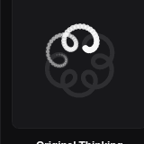
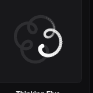
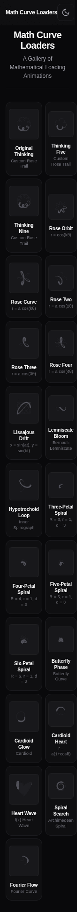
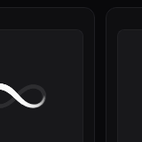
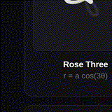
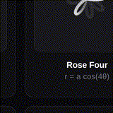

# @math-curve-loaders/react

[Mathematical curve loading animations](https://github.com/Paidax01/math-curve-loaders) as reusable React components. Zero CSS overhead — color via CSS `currentColor`, sizing via `style` or `className`.

<div>
  <a href="https://www.npmjs.com/package/@math-curve-loaders/react">
    
  </a>
  <a href="https://www.npmjs.com/package/@math-curve-loaders/react">
    
  </a>
  <a href="https://opensource.org/licenses/MIT">
    
  </a>
  <a href="https://github.com/themagicalmammal/math-curve-loaders-react">
    
  </a>
</div>

> **Install via npm:** `npm install @math-curve-loaders/react`
> **View on [npm](https://www.npmjs.com/package/@math-curve-loaders/react)**

## Installation

```bash
npm install @math-curve-loaders/react
```

```bash
yarn add @math-curve-loaders/react
```

```bash
pnpm add @math-curve-loaders/react
```

```bash
bun add @math-curve-loaders/react
```

## Quick Start

```tsx
import { OriginalThinking, RoseCurve } from '@math-curve-loaders/react';

export function App() {
  return (
    <div style={{ display: 'flex', gap: 40, justifyContent: 'center' }}>
      <OriginalThinking style={{ width: 120, height: 120 }} />
      <RoseCurve
        style={{ width: 80, height: 80, color: '#6366f1' }}
      />
    </div>
  );
}
```

## Available Curves (21)

| Curve | Tag | Preview |
|-------|-----|---------|
| `OriginalThinking` | Custom Rose Trail |  |
| `ThinkingFive` | Custom Rose Trail |  |
| `ThinkingNine` | Custom Rose Trail |  |
| `RoseOrbit` | r = cos(kθ) |  |
| `RoseCurve` | r = a cos(kθ) |  |
| `RoseTwo` | r = a cos(2θ) |  |
| `RoseThree` | r = a cos(3θ) |  |
| `RoseFour` | r = a cos(4θ) |  |
| `LissajousDrift` | x = sin(at), y = sin(bt) |  |
| `LemniscateBloom` | Bernoulli Lemniscate |  |
| `HypotrochoidLoop` | Inner Spirograph |  |
| `ThreePetalSpiral` | R = 3, r = 1, d = 3 |  |
| `FourPetalSpiral` | R = 4, r = 1, d = 3 |  |
| `FivePetalSpiral` | R = 5, r = 1, d = 3 |  |
| `SixPetalSpiral` | R = 6, r = 1, d = 3 |  |
| `ButterflyPhase` | Butterfly Curve |  |
| `CardioidGlow` | Cardioid |  |
| `CardioidHeart` | r = a(1+cosθ) |  |
| `HeartWave` | f(x) Heart Wave |  |
| `SpiralSearch` | Archimedean Spiral |  |
| `FourierFlow` | Fourier Curve |  |

## Props

Each curve component accepts:

| Prop | Type | Default | Description |
|------|------|---------|-------------|
| `config` | `Partial<CurveConfig>` | — | Override any curve parameter (see [Parameter Reference](#parameter-reference)) |
| `className` | `string` | — | Additional CSS class for styling |
| `style` | `React.CSSProperties` | — | Inline styles (`width`, `height`, `color`, etc.) |

### Overriding Parameters

Pass a `config` object to tweak any parameter:

```tsx
<OriginalThinking
  config={{
    particleCount: 100,   // More particles
    trailSpan: 0.5,       // Longer trails
    strokeWidth: 3,       // Thinner strokes
  }}
  style={{ width: 80, height: 80, color: '#ef4444' }}
/>
```

### Static `.config` Property

Access each curve's default configuration programmatically:

```tsx
// Read the default config
const cfg = OriginalThinking.config;
console.log(cfg.name);      // "Original Thinking"
console.log(cfg.tag);       // "Custom Rose Trail"
console.log(cfg.formula());
// "x(t) = 50 + (7.0 cos t - 3.0s cos 7t) * 3.9"
// "y(t) = 50 + (7.0 sin t - 3.0s sin 7t) * 3.9"
```

## Parameter Reference

These parameters are available on **all** curves via the `config` prop:

| Parameter | Type | Default Range | Description |
|-----------|------|---------------|-------------|
| `particleCount` | `number` | 24–140 | Number of animated particles on the trail |
| `trailSpan` | `number` | 0.12–0.68 | How long the particle trail appears |
| `durationMs` | `number` | 2400–12000 | Duration of one animation loop cycle |
| `pulseDurationMs` | `number` | 1800–10000 | Speed of the breathing/pulse animation |
| `rotationDurationMs` | `number` | 6000–60000 | Speed of full rotation (if enabled) |
| `strokeWidth` | `number` | 2.5–7.5 | Thickness of the curve stroke |

Each curve may have additional curve-specific parameters. Check the individual component's `.config` for the full list.

## CSS Strategy

Components render **pure SVG** with no bundled CSS. There is no styling overhead — you control everything.

### Color

Color is inherited via CSS `currentColor`:

```css
.my-loader {
  color: #6366f1; /* SVG stroke and particles inherit this */
}
```

### Sizing

Set width and height directly:

```tsx
<OriginalThinking style={{ width: 200, height: 200 }} />
```

Or via CSS:

```css
.my-loader {
  width: 100px;
  height: 100px;
  color: #ef4444;
}
```

```tsx
<OriginalThinking className="my-loader" />
```

### Background

The SVG is transparent by default. Add a background to the container:

```tsx
<div style={{ background: '#0f172a', padding: 24, borderRadius: 12 }}>
  <OriginalThinking style={{ width: 120, height: 120 }} />
</div>
```

## TypeScript

All components are fully typed. Import `CurveConfig` for type-safe overrides:

```tsx
import { OriginalThinking } from '@math-curve-loaders/react';
import type { CurveConfig } from '@math-curve-loaders/react';

const customConfig: Partial<CurveConfig> = {
  particleCount: 120,
  trailSpan: 0.5,
  durationMs: 6000,
};

<OriginalThinking config={customConfig} />
```

## Source

Original vanilla JS by [Paidax01/math-curve-loaders](https://github.com/Paidax01/math-curve-loaders) — a gallery of 21 mathematical curve loading animations.
